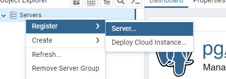
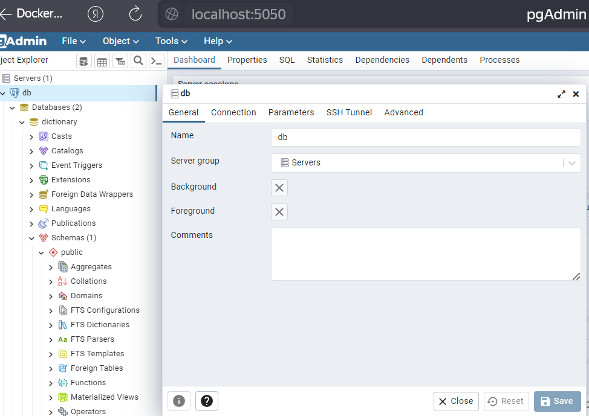
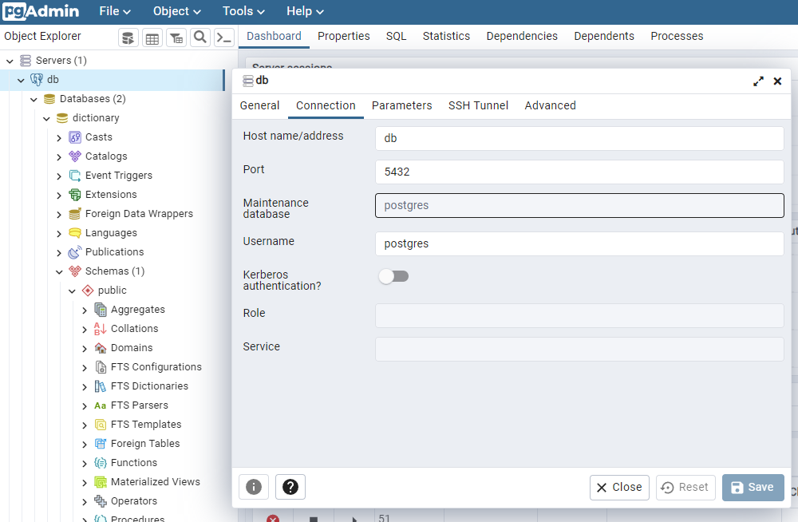

## Run

```cmd
    docker-compose up -d
```

## Additional

clean all saved data for creating db:
```
docker-compose down --volumes     
```







```
    gradle build
```

*Part running
```
    docker-compose -f docker-compose.yml run db
    docker-compose -f docker-compose.yml run pgadmin
    docker-compose -f docker-compose.yml run app
```
